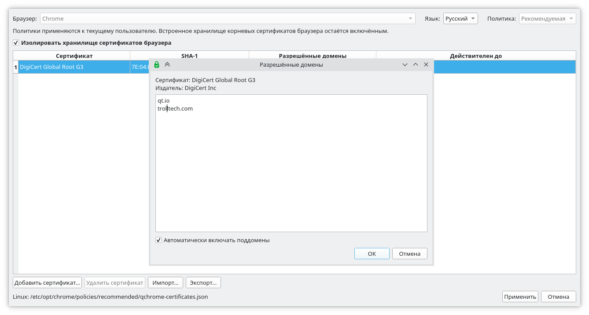

# QChromeCertificates — Qt 6 port

## Описание

Графическое приложение для Windows, управляющее изолированным набором доверенных CA-сертификатов в четырёх Chromium-браузерах:

- Google Chrome;
- Microsoft Edge;
- Brave;
- Chromium.
- В перспективе - другие Chromium-совместимые браузеры (Opera, Vivaldi, Yandex, Atom)

Примечание: браузер Opera не использует корпоративыне политики, но у него есть свой механизм ограничений на импортированные сертификаты на основе Chrome Root Store.
При импорте сертификата в Opera, можно явно указать на какие домены и адреса он распространяется.

<p align="center"></p>

First cross-platform C++/Qt 6 implementation of the functionality in
`mahairod/QChromeCertificates`.

## What is implemented

- `CAPlatformIntegrationEnabled`
- `CACertificatesWithConstraints`
- Chrome, Edge, Brave and Chromium browser definitions
- Windows HKCU policy storage
- Windows UAC fallback through `ShellExecuteExW` + `reg.exe`
- Linux JSON policy files (`managed` / `recommended`)
- macOS plist policy files (`/Library/Managed Preferences` or user Preferences)
- certificate loading/CA validation using OpenSSL
- DNS normalization including IDN/punycode
- CIDR parsing/normalization for legacy v1 entries
- JSON import/export
- dirty-state handling
- bilingual English/Russian UI
- `--self-test`
- CMake + Qt 6

## Dependencies

- C++20 compiler
- Qt 6 Core/Gui/Widgets
- OpenSSL 3.x (OpenSSL 1.1 also works with the APIs used here)

On Linux/macOS, the application writes the policy file directly. A mandatory
policy normally requires administrator/root permissions.

On Linux the default Chrome policy root is:
`/etc/opt/chrome/policies`

Override it for testing with:
`QCC_LINUX_POLICY_ROOT=/tmp/qcc-policies`

On macOS the default Chrome bundle identifier is:
`com.google.Chrome`

## Build

```sh
cmake -S . -B build -DCMAKE_PREFIX_PATH=/path/to/Qt/6
cmake --build build --config Release
```

## Self-test

```sh
./qchrocert --self-test
```

On Windows this creates a temporary HKCU test key. On Linux/macOS it only
tests the portable model/serialization code and does not touch Chrome policy
locations.

## Notes

This is deliberately a first complete port rather than a line-by-line
translation. The original application's policy model is retained, while
registry/file/plist persistence is behind a common `PolicyStore` interface.

The original v2 behavior intentionally preserves legacy `permitted_cidrs`
entries but refuses to apply them through the GUI. That behavior is retained.
